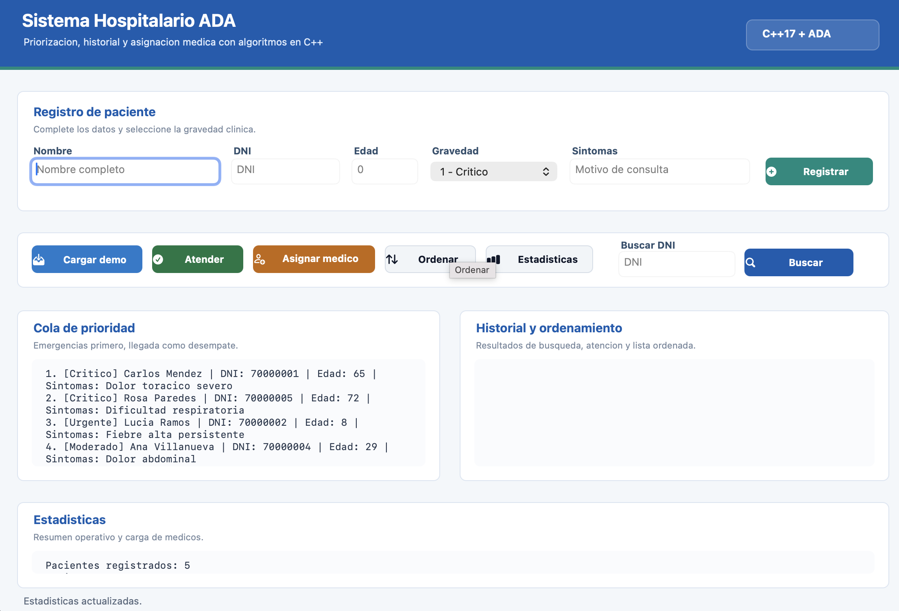

# Sistema Hospitalario ADA en C++

Proyecto base para el informe de Analisis y Diseno de Algoritmos. Implementa una cola de prioridad para pacientes, historial medico con hash table, ordenamientos QuickSort/MergeSort, asignacion voraz de medicos y benchmarking simple.

## Estructura

```text
.
├── include/              # Headers del sistema
├── src/                  # Implementacion de modulos
├── docs/                 # Informe y material del proyecto
├── data/                 # Datos de prueba
├── .vscode/              # Configuracion para VS Code
├── main.cpp              # Menu principal
├── Makefile              # Compilacion rapida con g++
└── CMakeLists.txt        # Compilacion con CMake
```

## Compilar con Make

```bash
make
./hospital
```

## Ejecutar con interfaz grafica en macOS

```bash
make gui
open build/HospitalGUI.app
```

Tambien puedes compilar y abrir en un solo paso:

```bash
make open-gui
```

## Compilar manualmente

```bash
g++ main.cpp src/*.cpp -Iinclude -o hospital -std=c++17
./hospital
```

## Compilar con CMake

```bash
cmake -S . -B build
cmake --build build
./build/hospital
```

En Windows con MinGW, el ejecutable puede quedar como `hospital.exe`.
